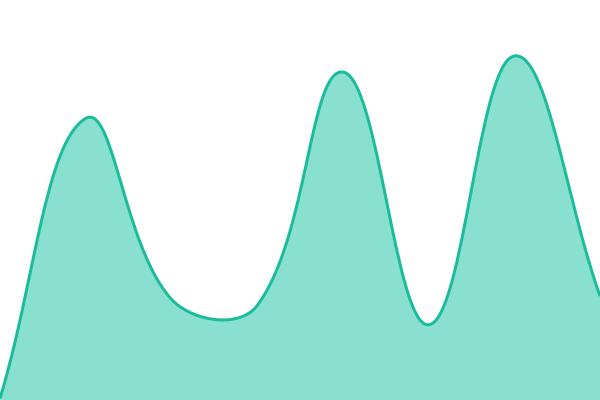
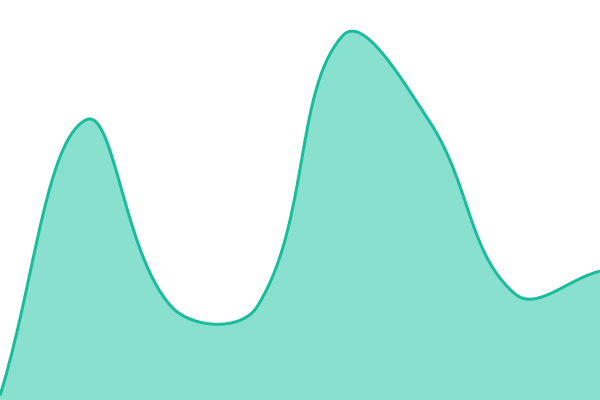
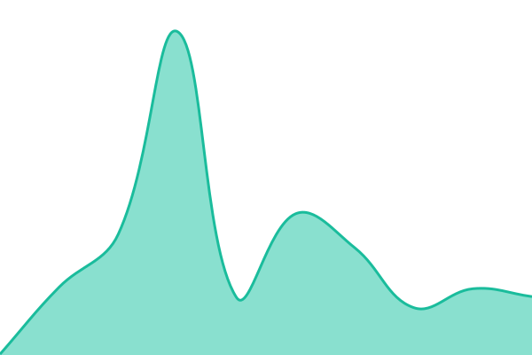
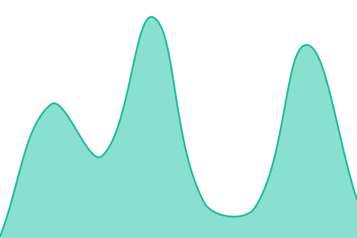
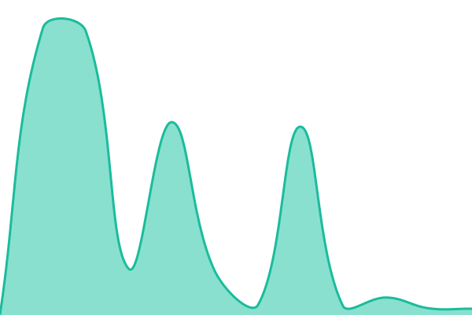
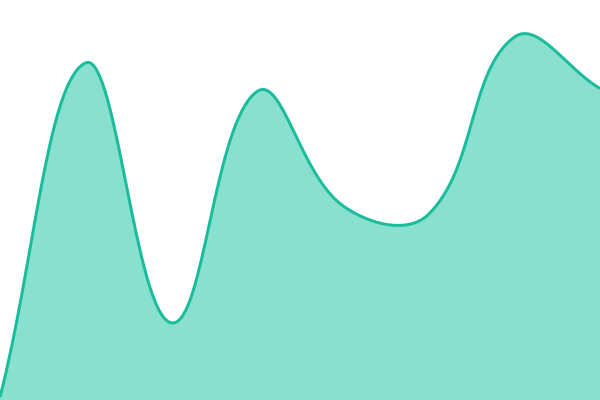
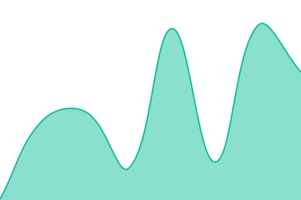

# [📈 Live Status](https://DotGov-Dev.github.io/govUpptime): <!--live status--> **🟧 Partial outage**

This repository contains the open-source uptime monitor and status page for [DotGov-Dev](dotgov.dev), powered by [Upptime](https://github.com/upptime/upptime).

With [Upptime](https://upptime.js.org), you can get your own unlimited and free uptime monitor and status page, powered entirely by a GitHub repository. We use [Issues](https://github.com/DotGov-Dev/govUpptime/issues) as incident reports, [Actions](https://github.com/DotGov-Dev/govUpptime/actions) as uptime monitors, and [Pages](https://DotGov-Dev.github.io/govUpptime) for the status page.

<!--start: status pages-->
<!-- This summary is generated by Upptime (https://github.com/upptime/upptime) -->
<!-- Do not edit this manually, your changes will be overwritten -->
<!-- prettier-ignore -->
| URL | Status | History | Response Time | Uptime |
| --- | ------ | ------- | ------------- | ------ |
|  [tools.usps.com](https://tools.usps.com) | 🟥 Down | [tools-usps-com.yml](https://github.com/DotGov-Dev/govUpTime/commits/HEAD/history/tools-usps-com.yml) | 

 127ms
     
 | 

<a href="https://DotGov-Dev.github.io/govUpTime/history/tools-usps-com">0.00%</a>
    

|  [reg.usps.com](https://reg.usps.com) | 🟩 Up | [reg-usps-com.yml](https://github.com/DotGov-Dev/govUpTime/commits/HEAD/history/reg-usps-com.yml) | 

 188ms
     
 | 

<a href="https://DotGov-Dev.github.io/govUpTime/history/reg-usps-com">100.00%</a>
    

|  [www.usps.com](https://www.usps.com) | 🟩 Up | [www-usps-com.yml](https://github.com/DotGov-Dev/govUpTime/commits/HEAD/history/www-usps-com.yml) | 

 164ms
     
 | 

<a href="https://DotGov-Dev.github.io/govUpTime/history/www-usps-com">100.00%</a>
    

|  [informeddelivery.usps.com](https://informeddelivery.usps.com) | 🟩 Up | [informeddelivery-usps-com.yml](https://github.com/DotGov-Dev/govUpTime/commits/HEAD/history/informeddelivery-usps-com.yml) | 

 270ms
     
 | 

<a href="https://DotGov-Dev.github.io/govUpTime/history/informeddelivery-usps-com">100.00%</a>
    

|  [www.ncbi.nlm.nih.gov](https://www.ncbi.nlm.nih.gov) | 🟩 Up | [www-ncbi-nlm-nih-gov.yml](https://github.com/DotGov-Dev/govUpTime/commits/HEAD/history/www-ncbi-nlm-nih-gov.yml) | 

 211ms
     
 | 

<a href="https://DotGov-Dev.github.io/govUpTime/history/www-ncbi-nlm-nih-gov">100.00%</a>
    

|  [pubmed.ncbi.nlm.nih.gov](https://pubmed.ncbi.nlm.nih.gov) | 🟩 Up | [pubmed-ncbi-nlm-nih-gov.yml](https://github.com/DotGov-Dev/govUpTime/commits/HEAD/history/pubmed-ncbi-nlm-nih-gov.yml) | 

 165ms
     
 | 

<a href="https://DotGov-Dev.github.io/govUpTime/history/pubmed-ncbi-nlm-nih-gov">100.00%</a>
    

|  [medlineplus.gov](https://medlineplus.gov) | 🟩 Up | [medlineplus-gov.yml](https://github.com/DotGov-Dev/govUpTime/commits/HEAD/history/medlineplus-gov.yml) | 

 166ms
     
 | 

<a href="https://DotGov-Dev.github.io/govUpTime/history/medlineplus-gov">100.00%</a>
    

|  [forecast.weather.gov](https://forecast.weather.gov) | 🟩 Up | [forecast-weather-gov.yml](https://github.com/DotGov-Dev/govUpTime/commits/HEAD/history/forecast-weather-gov.yml) | 

 193ms
     
 | 

<a href="https://DotGov-Dev.github.io/govUpTime/history/forecast-weather-gov">100.00%</a>
    

|  [www.irs.gov](https://www.irs.gov) | 🟩 Up | [www-irs-gov.yml](https://github.com/DotGov-Dev/govUpTime/commits/HEAD/history/www-irs-gov.yml) | 

 165ms
     
 | 

<a href="https://DotGov-Dev.github.io/govUpTime/history/www-irs-gov">100.00%</a>
    

|  [secure.login.gov](https://secure.login.gov) | 🟩 Up | [secure-login-gov.yml](https://github.com/DotGov-Dev/govUpTime/commits/HEAD/history/secure-login-gov.yml) | 

 178ms
     
 | 

<a href="https://DotGov-Dev.github.io/govUpTime/history/secure-login-gov">100.00%</a>
    

|  [www.cdc.gov](https://www.cdc.gov) | 🟥 Down | [www-cdc-gov.yml](https://github.com/DotGov-Dev/govUpTime/commits/HEAD/history/www-cdc-gov.yml) | 

 65ms
     
 | 

<a href="https://DotGov-Dev.github.io/govUpTime/history/www-cdc-gov">79.64%</a>
    

|  [www.ssa.gov](https://www.ssa.gov) | 🟥 Down | [www-ssa-gov.yml](https://github.com/DotGov-Dev/govUpTime/commits/HEAD/history/www-ssa-gov.yml) | 

 47ms
     
 | 

<a href="https://DotGov-Dev.github.io/govUpTime/history/www-ssa-gov">0.00%</a>
    

|  [studentaid.gov](https://studentaid.gov) | 🟩 Up | [studentaid-gov.yml](https://github.com/DotGov-Dev/govUpTime/commits/HEAD/history/studentaid-gov.yml) | 

 92ms
     
 | 

<a href="https://DotGov-Dev.github.io/govUpTime/history/studentaid-gov">96.99%</a>
    

|  [www.weather.gov](https://www.weather.gov) | 🟩 Up | [www-weather-gov.yml](https://github.com/DotGov-Dev/govUpTime/commits/HEAD/history/www-weather-gov.yml) | 

 87ms
     
 | 

<a href="https://DotGov-Dev.github.io/govUpTime/history/www-weather-gov">100.00%</a>
    

|  [www.nps.gov](https://www.nps.gov) | 🟩 Up | [www-nps-gov.yml](https://github.com/DotGov-Dev/govUpTime/commits/HEAD/history/www-nps-gov.yml) | 

 112ms
     
 | 

<a href="https://DotGov-Dev.github.io/govUpTime/history/www-nps-gov">100.00%</a>
    

|  [www.uscis.gov](https://www.uscis.gov) | 🟩 Up | [www-uscis-gov.yml](https://github.com/DotGov-Dev/govUpTime/commits/HEAD/history/www-uscis-gov.yml) | 

 110ms
     
 | 

<a href="https://DotGov-Dev.github.io/govUpTime/history/www-uscis-gov">100.00%</a>
    

|  [travel.state.gov](https://travel.state.gov) | 🟩 Up | [travel-state-gov.yml](https://github.com/DotGov-Dev/govUpTime/commits/HEAD/history/travel-state-gov.yml) | 

 1014ms
     
 | 

<a href="https://DotGov-Dev.github.io/govUpTime/history/travel-state-gov">100.00%</a>
    

|  [www.va.gov](https://www.va.gov) | 🟩 Up | [www-va-gov.yml](https://github.com/DotGov-Dev/govUpTime/commits/HEAD/history/www-va-gov.yml) | 

 652ms
     
 | 

<a href="https://DotGov-Dev.github.io/govUpTime/history/www-va-gov">100.00%</a>
    

|  [www.usajobs.gov](https://www.usajobs.gov) | 🟩 Up | [www-usajobs-gov.yml](https://github.com/DotGov-Dev/govUpTime/commits/HEAD/history/www-usajobs-gov.yml) | 

 104ms
     
 | 

<a href="https://DotGov-Dev.github.io/govUpTime/history/www-usajobs-gov">100.00%</a>
    

|  [radar.weather.gov](https://radar.weather.gov) | 🟩 Up | [radar-weather-gov.yml](https://github.com/DotGov-Dev/govUpTime/commits/HEAD/history/radar-weather-gov.yml) | 

 88ms
     
 | 

<a href="https://DotGov-Dev.github.io/govUpTime/history/radar-weather-gov">100.00%</a>
    

|  [ceac.state.gov](https://ceac.state.gov) | 🟥 Down | [ceac-state-gov.yml](https://github.com/DotGov-Dev/govUpTime/commits/HEAD/history/ceac-state-gov.yml) | 

 0ms
     
 | 

<a href="https://DotGov-Dev.github.io/govUpTime/history/ceac-state-gov">100.00%</a>
    

|  [ais.usvisa-info.com](https://ais.usvisa-info.com) | 🟩 Up | [ais-usvisa-info-com.yml](https://github.com/DotGov-Dev/govUpTime/commits/HEAD/history/ais-usvisa-info-com.yml) | 

 361ms
     
 | 

<a href="https://DotGov-Dev.github.io/govUpTime/history/ais-usvisa-info-com">100.00%</a>
    

|  [www.fda.gov](https://www.fda.gov) | 🟥 Down | [www-fda-gov.yml](https://github.com/DotGov-Dev/govUpTime/commits/HEAD/history/www-fda-gov.yml) | 

 110ms
     
 | 

<a href="https://DotGov-Dev.github.io/govUpTime/history/www-fda-gov">0.00%</a>
    

|  [egov.uscis.gov](https://egov.uscis.gov) | 🟥 Down | [egov-uscis-gov.yml](https://github.com/DotGov-Dev/govUpTime/commits/HEAD/history/egov-uscis-gov.yml) | 

 25ms
     
 | 

<a href="https://DotGov-Dev.github.io/govUpTime/history/egov-uscis-gov">100.00%</a>
    

|  [www.myhealth.va.gov](https://www.myhealth.va.gov) | 🟩 Up | [www-myhealth-va-gov.yml](https://github.com/DotGov-Dev/govUpTime/commits/HEAD/history/www-myhealth-va-gov.yml) | 

 742ms
     
 | 

<a href="https://DotGov-Dev.github.io/govUpTime/history/www-myhealth-va-gov">100.00%</a>
    

|  [www.medicare.gov](https://www.medicare.gov) | 🟩 Up | [www-medicare-gov.yml](https://github.com/DotGov-Dev/govUpTime/commits/HEAD/history/www-medicare-gov.yml) | 

 136ms
     
 | 

<a href="https://DotGov-Dev.github.io/govUpTime/history/www-medicare-gov">100.00%</a>
    

|  [www.justice.gov](https://www.justice.gov) | 🟩 Up | [www-justice-gov.yml](https://github.com/DotGov-Dev/govUpTime/commits/HEAD/history/www-justice-gov.yml) | 

 96ms
     
 | 

<a href="https://DotGov-Dev.github.io/govUpTime/history/www-justice-gov">99.35%</a>
    

|  [www.nhlbi.nih.gov](https://www.nhlbi.nih.gov) | 🟩 Up | [www-nhlbi-nih-gov.yml](https://github.com/DotGov-Dev/govUpTime/commits/HEAD/history/www-nhlbi-nih-gov.yml) | 

 67ms
     
 | 

<a href="https://DotGov-Dev.github.io/govUpTime/history/www-nhlbi-nih-gov">100.00%</a>
    

|  [www.cancer.gov](https://www.cancer.gov) | 🟩 Up | [www-cancer-gov.yml](https://github.com/DotGov-Dev/govUpTime/commits/HEAD/history/www-cancer-gov.yml) | 

 176ms
     
 | 

<a href="https://DotGov-Dev.github.io/govUpTime/history/www-cancer-gov">100.00%</a>
    

|  [www.usa.gov](https://www.usa.gov) | 🟩 Up | [www-usa-gov.yml](https://github.com/DotGov-Dev/govUpTime/commits/HEAD/history/www-usa-gov.yml) | 

 81ms
     
 | 

<a href="https://DotGov-Dev.github.io/govUpTime/history/www-usa-gov">100.00%</a>
    

<!--end: status pages-->

[**Visit our status website →**](https://DotGov-Dev.github.io/govUpptime)

## 📄 License

- Powered by: [Upptime](https://github.com/upptime/upptime)
- Code: [MIT](./LICENSE) © [Anand Chowdhary](https://anandchowdhary.com), supported by [Pabio](https://pabio.com)
- Data in the `./history` directory: [Open Database License](https://opendatacommons.org/licenses/odbl/1-0/)
